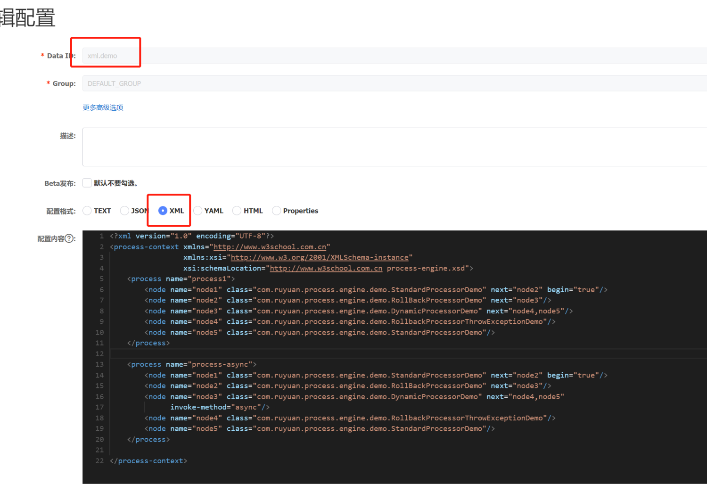

## 儒猿流程引擎

### 基本概念
流程引擎本质上是一个基于责任链模式拓展的组件，在责任链基础上增加了一些功能。 

在流程引擎中，一个流程由多个流程节点组成，流程节点之间的顺序关系可以通过配置文件来定义，支持动态配置流程节点顺序。
通过流程引擎，可以将系统一些业务逻辑拆分为一个一个节点，然后可以对这些节点进行自由组合，动态切换节点顺序，可以快速适应多变的业务发展。

目前定义了3种类型的流程节点，分别如下：

- 标准流程节点：一个普通的Action
- 可回滚流程节点：当后续节点出现异常的时候，会执行可回滚操作的Action
- 动态流程节点：在程序运行的时候根据状态动态选择下一个节点的Action
 
### 快速启动

Maven引用

```
<dependency>
    <groupId>com.ruyuan</groupId>
    <artifactId>process-engine-wrapper</artifactId>
    <version>0.0.7</version>
</dependency>
```
#### xml方式配置
声明几个节点

标准节点集成StandardProcessor
```
@Component
public class StandardProcessorDemo2 extends StandardProcessor {
    @Override
    protected void processInternal(ProcessContext context) {
        System.out.println("StandProcessor " + context.get("id"));
    }
}
```
可回滚节点继承RollbackProcessor
```
@Component
public class RollBackProcessorDemo extends RollbackProcessor {

    @Override
    protected void processInternal(ProcessContext context) {
        System.out.println("RollBackProcessor " + context.get("id"));
    }

    @Override
    protected void rollback(ProcessContext context) {
        System.out.println("rollback RollBackProcessor " + context.get("id"));
    }
}
```
动态节点继承DynamicProcessor

```
@Component
public class DynamicProcessorDemo extends DynamicProcessor {

    @Override
    protected void processInternal(ProcessContext context) {
        System.out.println("DynamicProcess " + context.get("id"));
    }

    @Override
    protected String nextNodeId(ProcessContext context) {
        return "node4";
    }
}
```
声明xml配置文件：
```
<?xml version="1.0" encoding="UTF-8"?>
<process-context xmlns="http://www.w3school.com.cn"
xmlns:xsi="http://www.w3.org/2001/XMLSchema-instance"
xsi:schemaLocation="http://www.w3school.com.cn process-engine.xsd">
    <process name="process1">
    <node name="node1" class="xxx.StandardProcessorDemo" next="node2" begin="true"/>
    <node name="node2" class="xxx.RollBackProcessorDemo" next="node3"/>
    <node name="node3" class="xxx.DynamicProcessorDemo" next="node4,node5"/>
    <node name="node4" class="xxx.StandardProcessorDemo"/>
    <node name="node5" class="xxx.StandardProcessorDemo" invoke-method="sync"/>
    </process>
</process-context>
```
其中配置文件的意思是，声明了一个process1的流程，其中第一个节点为node1,下一个节点为node2，再下一个节点为node3，
node3的下一个节点可能是node4或者node5, 这要根据代码运行判断。上面的代码例子中，node3的下一个节点指定了为id是node4的节点。

运行代码：
```
public static void main(String[] args) throws Exception {
    ProcessEngine processEngine = new ProcessEngine(
    new ClassPathXmlProcessParser("process-demo.xml"));
    ProcessContext process1 = processEngine.getContext("process1");
    process1.set("nextId", "node4");
    process1.start();
}
```

其中可以通过ProcessContext.set(key,value)方法在不同的节点中传递信息。

#### 注解方式集成
在启动类加上@EnableProcessEngine("packageName"),
value值为扫描节点的包名，接着在每一个节点上面加上注解即可。框架会自动扫描节点，并根据groupId 聚合节点构建成一个流程
```
@Slf4j
@RestController
@SpringBootApplication
@EnableProcessEngine("process-demo.xml")
public class Application {
    @Autowired
    private ProcessContextFactory processContextFactory;

    public static void main(String[] args) {
        SpringApplication.run(Application.class, args);
    }

    @GetMapping("/test1")
    public String test1() {
        ProcessContext process1 = processContextFactory.getContext("process1");
        process1.set("id", "process1");
        process1.start();
        return "true";
    }
}
```

### 动态刷新流程节点配置
流程引擎的一大优势是可以任意调整流程的顺序，可以配合配置中心实现动态更新流程配置。

以下例子以nacos作为配置中心为例：

nacos上面添加配置：



接着在应用程序启动的时候加入如下代码，即可重新刷新流程

```
String serverAddr = "localhost";
String dataId = "xml.demo";
String group = "DEFAULT_GROUP";
Properties properties = new Properties();
properties.put(PropertyKeyConst.SERVER_ADDR, serverAddr);
ConfigService configService = NacosFactory.createConfigService(properties);
String content = configService.getConfig(dataId, group, 5000);
configService.addListener(dataId, group, new AbstractListener() {
    @Override
    public void receiveConfigInfo(String configInfo) {
        StringXmlProcessParser stringXmlProcessParser = new
        StringXmlProcessParser(configInfo);
        processContextFactory.refresh(stringXmlProcessParser.parse());
        System.out.println("recieve:" + configInfo);
    }
});
```

### 基于Redis记录流程执行状态实现一致性

#### 实现思路
在流程运行过程中，会记录流程的元数据信息到redis,比如流程id为 process1的节点，保存的信息如下：

```
5ba738366d57461c9179f0b0e45f8b37:1:process2 -> {
   process-name: process1
   current-execute-node: node1
   process-param#${key}#${valueClassName}: jsonSerializeValue
   current-execute-state: execute/rollback
}
```
其中key为`5ba738366d57461c9179f0b0e45f8b37:1:process2`分别用 实例id + 序列号 + 流程id 组成，可以标识每一次的流程实例。

value的值解释如下：

- process-name：流程名称  5  
- current-execute-node: 当前正在执行的节点或正在回滚的节点
- process-param#${key}#${valueClassName}：其中${key}为上下文中的参数key，${value}
  是参数的classname，jsonSerializeValue为该对象的值通过json序列化之后的json串，这种数据可能有0个或n个。这种实现思路要求上下文参数中的key不能带有#
- current-execute-state: 标识当前流程执行的节点，invoke为正常调用节点，rollback为回滚阶段。

另外使用一个有序集合记录了当前正在运行的流程。如下：

```
ruyuan-process-engine:processes -> {
    5ba738366d57461c9179f0b0e45f8b37:1:process2 -> 1643523410
}
```
其中score为每次更新状态的时间戳，以秒为单位。

在每次更新元数据的时候，都会更新有序集合的分数。当整个流程都执行完毕，会将元数据删除，并且将有序集合中的记录也删除。


#### 后台扫描执行失败的流程
后台启动一个线程， 每隔1分钟(可以自行修改)扫描一次有序集合，如果发现有某个流程超过5分钟(可以自行修改)都没有更新，则认定该流程执行失败了。

此时会把流程拿出来，然后对该流程进行加分布式锁。接着进行根据元数据重新构建流程，回放该流程。

具体实现代码在：ProcessContextFactory#ProcessPlaybackTask类中。

####  关于动态刷新流程节点配置和最终一致性的冲突
比如某个流程执行顺序为1,2,3,4,5. 假设此时机器宕机了，流程执行到一半进行重启了。此时流程数据会保存在redis中，等待5分钟后继续执行。

但是如果机器重启后，在5分钟到来之前，通过配置中心动态修改了流程的顺序，比如改成了1,2,3,5,4, 此时重放流程就会有可能导致数据有问题。

这个问题提供了2个解决方案：

1、继续执行流程
2、丢弃该重放流程任务

具体实现为ProcessRefreshPolicy

#### SpringBoot集成
声明一个ProcessStateStore的bean。这里提供了默认的实现DefaultProcessStateStore

```
    @Bean
    public ProcessStateStore processStateStore() {
        return new DefaultProcessStateStore(redissonClient());
    }
    
    
    private static RedissonClient redissonClient() {
        Config config = new Config();
        config.useSingleServer().setAddress("redis://127.0.0.1:6379")
                .setConnectionMinimumIdleSize(10)
                .setConnectionPoolSize(100)
                .setIdleConnectionTimeout(600000)
                .setSubscriptionConnectionMinimumIdleSize(10)
                .setSubscriptionConnectionPoolSize(100)
                .setTimeout(30000);
        config.setCodec(new StringCodec());
        config.setThreads(5);
        config.setNettyThreads(5);
        return Redisson.create(config);
    }
```
如果不想让集成最终一致性的功能，可以返回一个NoOpProcessStateStore

```
    @Bean
    public ProcessStateStore processStateStore() {
        return new NoOpProcessStateStore();
    }
```

默认情况下，如果进行了动态刷新流程引擎，采用的策略为丢弃任务，如果想要配置为继续执行任务可以如下：
```
    @Bean
    public ProcessStateStore processStateStore() {
        return new DefaultProcessStateStore(redissonClient(), new ContinueProcessRefreshPolicy());
    }
    
    
    private static RedissonClient redissonClient() {
        Config config = new Config();
        config.useSingleServer().setAddress("redis://127.0.0.1:6379")
                .setConnectionMinimumIdleSize(10)
                .setConnectionPoolSize(100)
                .setIdleConnectionTimeout(600000)
                .setSubscriptionConnectionMinimumIdleSize(10)
                .setSubscriptionConnectionPoolSize(100)
                .setTimeout(30000);
        config.setCodec(new StringCodec());
        config.setThreads(5);
        config.setNettyThreads(5);
        return Redisson.create(config);
    }
```

最后，如果想要自己实现流程刷新的策略，可以自行实现ProcessRefreshPolicy接口，

实现自定义逻辑，然后创建ProcessStateStore的时候通过构造函数穿进去，

另外如果觉得基于Redis作为存储实现最终一致性不好，也可以自行实现ProcessStateStore接口，
实现自定义的存储策略，比如可以存储在mysql、mongodb等其他存储中


