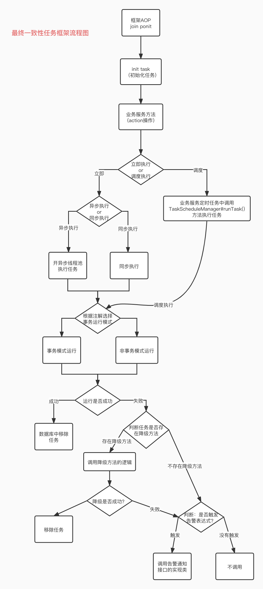
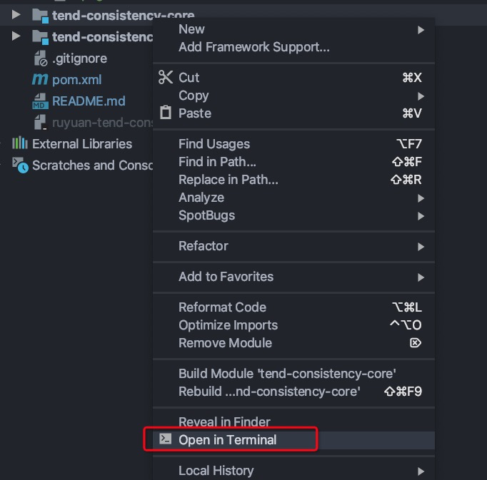
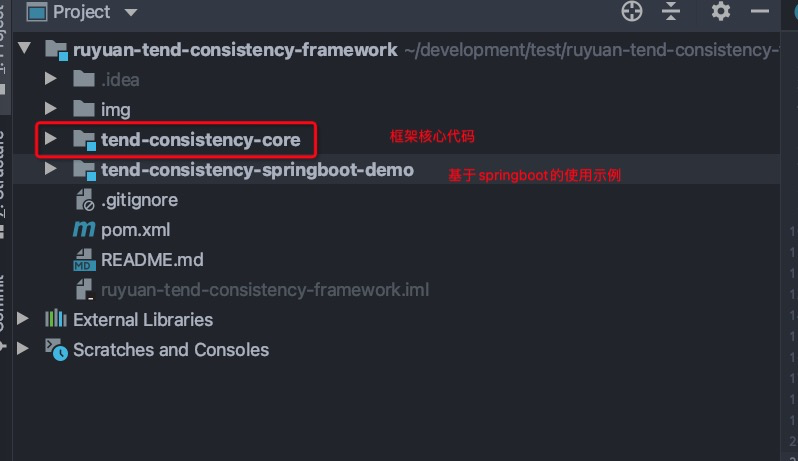

## 1、执行流程图



## 2、使用场景

- 用于保证某个操作一定成功，最终一致。

## 3、数据库脚本

### 3.1、单库单任务表的数据库脚本

> 在所在服务的数据库中加入该表即可，如果需要分库，在每个库中创建一份即可

```SQL
CREATE DATABASE `consistency_task` CHARACTER SET 'utf8' COLLATE 'utf8mb4_general_ci';

USE `consistency_task`;

CREATE TABLE `ruyuan_tend_consistency_task` (
  `id` bigint NOT NULL AUTO_INCREMENT COMMENT '主键自增',
  `task_id` varchar(500) CHARACTER SET utf8mb4 COLLATE utf8mb4_general_ci NOT NULL COMMENT '用户自定义的任务名称，如果没有则使用方法签名',
  `task_status` int NOT NULL DEFAULT '0' COMMENT '执行状态',
  `execute_times` int NOT NULL COMMENT '执行次数',
  `execute_time` bigint NOT NULL COMMENT '执行时间',
  `parameter_types` varchar(255) CHARACTER SET utf8mb4 COLLATE utf8mb4_general_ci NOT NULL COMMENT '参数的类路径名称',
  `method_name` varchar(100) CHARACTER SET utf8mb4 COLLATE utf8mb4_general_ci NOT NULL COMMENT '方法名',
  `method_sign_name` varchar(200) CHARACTER SET utf8mb4 COLLATE utf8mb4_general_ci NOT NULL DEFAULT '' COMMENT '方法签名',
  `execute_interval_sec` int NOT NULL DEFAULT '60' COMMENT '执行间隔秒',
  `delay_time` int NOT NULL DEFAULT '60' COMMENT '延迟时间：单位秒',
  `task_parameter` varchar(200) CHARACTER SET utf8mb4 COLLATE utf8mb4_general_ci NOT NULL DEFAULT '' COMMENT '任务参数',
  `performance_way` int NOT NULL COMMENT '执行模式：1、立即执行 2、调度执行',
  `thread_way` int NOT NULL COMMENT '线程模型 1、异步 2、同步',
  `error_msg` varchar(200) CHARACTER SET utf8mb4 COLLATE utf8mb4_general_ci NOT NULL DEFAULT '' COMMENT '执行的error信息',
  `alert_expression` varchar(100) CHARACTER SET utf8mb4 COLLATE utf8mb4_general_ci DEFAULT NULL COMMENT '告警表达式',
  `alert_action_bean_name` varchar(255) CHARACTER SET utf8mb4 COLLATE utf8mb4_general_ci DEFAULT NULL COMMENT '告警逻辑的的执行beanName',
  `fallback_class_name` varchar(255) CHARACTER SET utf8mb4 COLLATE utf8mb4_general_ci DEFAULT NULL COMMENT '降级逻辑的的类路径',
  `fallback_error_msg` varchar(200) CHARACTER SET utf8mb4 COLLATE utf8mb4_general_ci DEFAULT NULL COMMENT '降级失败时的错误信息',
  `shard_key` bigint DEFAULT '0' COMMENT '任务分片键',
  `gmt_create` datetime NOT NULL COMMENT '创建时间',
  `gmt_modified` datetime NOT NULL COMMENT '修改时间',
  PRIMARY KEY (`id`),
  UNIQUE KEY `uk_id_shard_key` (`id`,`shard_key`) USING BTREE
) ENGINE=InnoDB DEFAULT CHARSET=utf8mb4 COLLATE=utf8mb4_general_ci;
```

### 3.2、多库每个库一个任务表的数据库脚本

> （这里以2库每个库一张任务表举例）

```sql
CREATE DATABASE `consistency_task0` CHARACTER SET 'utf8' COLLATE 'utf8mb4_general_ci';

USE `consistency_task0`;

CREATE TABLE `ruyuan_tend_consistency_task` (
  `id` bigint NOT NULL AUTO_INCREMENT COMMENT '主键自增',
  `task_id` varchar(500) CHARACTER SET utf8mb4 COLLATE utf8mb4_general_ci NOT NULL COMMENT '用户自定义的任务名称，如果没有则使用方法签名',
  `task_status` int NOT NULL DEFAULT '0' COMMENT '执行状态',
  `execute_times` int NOT NULL COMMENT '执行次数',
  `execute_time` bigint NOT NULL COMMENT '执行时间',
  `parameter_types` varchar(255) CHARACTER SET utf8mb4 COLLATE utf8mb4_general_ci NOT NULL COMMENT '参数的类路径名称',
  `method_name` varchar(100) CHARACTER SET utf8mb4 COLLATE utf8mb4_general_ci NOT NULL COMMENT '方法名',
  `method_sign_name` varchar(200) CHARACTER SET utf8mb4 COLLATE utf8mb4_general_ci NOT NULL DEFAULT '' COMMENT '方法签名',
  `execute_interval_sec` int NOT NULL DEFAULT '60' COMMENT '执行间隔秒',
  `delay_time` int NOT NULL DEFAULT '60' COMMENT '延迟时间：单位秒',
  `task_parameter` varchar(200) CHARACTER SET utf8mb4 COLLATE utf8mb4_general_ci NOT NULL DEFAULT '' COMMENT '任务参数',
  `performance_way` int NOT NULL COMMENT '执行模式：1、立即执行 2、调度执行',
  `thread_way` int NOT NULL COMMENT '线程模型 1、异步 2、同步',
  `error_msg` varchar(200) CHARACTER SET utf8mb4 COLLATE utf8mb4_general_ci NOT NULL DEFAULT '' COMMENT '执行的error信息',
  `alert_expression` varchar(100) CHARACTER SET utf8mb4 COLLATE utf8mb4_general_ci DEFAULT NULL COMMENT '告警表达式',
  `alert_action_bean_name` varchar(255) CHARACTER SET utf8mb4 COLLATE utf8mb4_general_ci DEFAULT NULL COMMENT '告警逻辑的的执行beanName',
  `fallback_class_name` varchar(255) CHARACTER SET utf8mb4 COLLATE utf8mb4_general_ci DEFAULT NULL COMMENT '降级逻辑的的类路径',
  `fallback_error_msg` varchar(200) CHARACTER SET utf8mb4 COLLATE utf8mb4_general_ci DEFAULT NULL COMMENT '降级失败时的错误信息',
  `shard_key` bigint DEFAULT '0' COMMENT '任务分片键',
  `gmt_create` datetime NOT NULL COMMENT '创建时间',
  `gmt_modified` datetime NOT NULL COMMENT '修改时间',
  PRIMARY KEY (`id`),
  UNIQUE KEY `uk_id_shard_key` (`id`,`shard_key`) USING BTREE
) ENGINE=InnoDB DEFAULT CHARSET=utf8mb4 COLLATE=utf8mb4_general_ci;

CREATE DATABASE `consistency_task1` CHARACTER SET 'utf8' COLLATE 'utf8mb4_general_ci';

USE `consistency_task1`;

CREATE TABLE `ruyuan_tend_consistency_task` (
  `id` bigint NOT NULL AUTO_INCREMENT COMMENT '主键自增',
  `task_id` varchar(500) CHARACTER SET utf8mb4 COLLATE utf8mb4_general_ci NOT NULL COMMENT '用户自定义的任务名称，如果没有则使用方法签名',
  `task_status` int NOT NULL DEFAULT '0' COMMENT '执行状态',
  `execute_times` int NOT NULL COMMENT '执行次数',
  `execute_time` bigint NOT NULL COMMENT '执行时间',
  `parameter_types` varchar(255) CHARACTER SET utf8mb4 COLLATE utf8mb4_general_ci NOT NULL COMMENT '参数的类路径名称',
  `method_name` varchar(100) CHARACTER SET utf8mb4 COLLATE utf8mb4_general_ci NOT NULL COMMENT '方法名',
  `method_sign_name` varchar(200) CHARACTER SET utf8mb4 COLLATE utf8mb4_general_ci NOT NULL DEFAULT '' COMMENT '方法签名',
  `execute_interval_sec` int NOT NULL DEFAULT '60' COMMENT '执行间隔秒',
  `delay_time` int NOT NULL DEFAULT '60' COMMENT '延迟时间：单位秒',
  `task_parameter` varchar(200) CHARACTER SET utf8mb4 COLLATE utf8mb4_general_ci NOT NULL DEFAULT '' COMMENT '任务参数',
  `performance_way` int NOT NULL COMMENT '执行模式：1、立即执行 2、调度执行',
  `thread_way` int NOT NULL COMMENT '线程模型 1、异步 2、同步',
  `error_msg` varchar(200) CHARACTER SET utf8mb4 COLLATE utf8mb4_general_ci NOT NULL DEFAULT '' COMMENT '执行的error信息',
  `alert_expression` varchar(100) CHARACTER SET utf8mb4 COLLATE utf8mb4_general_ci DEFAULT NULL COMMENT '告警表达式',
  `alert_action_bean_name` varchar(255) CHARACTER SET utf8mb4 COLLATE utf8mb4_general_ci DEFAULT NULL COMMENT '告警逻辑的的执行beanName',
  `fallback_class_name` varchar(255) CHARACTER SET utf8mb4 COLLATE utf8mb4_general_ci DEFAULT NULL COMMENT '降级逻辑的的类路径',
  `fallback_error_msg` varchar(200) CHARACTER SET utf8mb4 COLLATE utf8mb4_general_ci DEFAULT NULL COMMENT '降级失败时的错误信息',
  `shard_key` bigint DEFAULT '0' COMMENT '任务分片键',
  `gmt_create` datetime NOT NULL COMMENT '创建时间',
  `gmt_modified` datetime NOT NULL COMMENT '修改时间',
  PRIMARY KEY (`id`),
  UNIQUE KEY `uk_id_shard_key` (`id`,`shard_key`) USING BTREE
) ENGINE=InnoDB DEFAULT CHARSET=utf8mb4 COLLATE=utf8mb4_general_ci;
```

## 4、安装tend-consistency-core到本地maven仓库

在idea中，右键tend-consistency-core > open in terminal > 输入：mvn clean install

- 右键tend-consistency-core：


- 选择open in terminal：



- 执行命令：mvn clean install


## 5、在您的springboot工程中添加依赖

```xml
<dependency>
    <groupId>com.ruyuan</groupId>
    <artifactId>tend-consistency-core</artifactId>
    <version>1.0.0</version>
</dependency>
```

## 6、在工程中的配置文件添加配置（optional 可选）

> 做了配置项提示功能，在配置application.yml或application.properties文件中可以通过输入 ruyuan 得到相关提示

### 6.1、任务表为单库的配置

```yaml
ruyuan:
  tend:
    consistency:
      parallel:
        pool:
          # 不配置默认值就是5
          thread-max-pool-size: 5
          # 不配置默认值就是5
          thread-core-pool-size: 5
          # 不配置默认值就是60
          thread-pool-keep-alive-time: 60
          # 不配置默认值就是SECONDS
          thread-pool-keep-alive-time-unit: SECONDS
          # 不配置默认值就是100
          thread-pool-queue-size: 100
      action:
        # 默认值是0 也就是 只要出现失败的情况，就会走降级逻辑，这里记的配置降级类。如果没有配置降级类，则不会走降级逻辑
        fail-count-threshold: 0
      shard:
        # 表示任务表一个库中，如果确认使用单库模式，可以不配置 默认就是false  这里只是为了说明，就写了出来
        task-shared: false
```

### 6.2、任务表为多库的配置

```yaml
ruyuan:
  tend:
    consistency:
      parallel:
        pool:
          thread-max-pool-size: 6
          thread-core-pool-size: 6
          thread-pool-keep-alive-time: 60
          thread-pool-keep-alive-time-unit: SECONDS
          thread-pool-queue-size: 100
      action:
        fail-count-threshold: 0
      shard:
        # 表示任务表有多个库，一致性框架自身会计算分库的key
        task-shared: true
# 开启分库以后记的把分库的配置也写出来，框架使用了shardingsphere作为分库的插件，记的在项目的pom依赖中加入shardingsphere的依赖，下面的配置是分两个库为演示
spring:
  main:
    allow-bean-definition-overriding: true
  shardingsphere:
    datasource:
      # 数据源名称
      names: ds0,ds1
      ds0:
        jdbc-url: jdbc:mysql://localhost:3306/consistency_task0?characterEncoding=utf8&characterSetResults=utf8&autoReconnect=true&failOverReadOnly=false&useSSL=false
        username: root
        password: rootroot
        driver-class-name: com.mysql.cj.jdbc.Driver
        type: com.zaxxer.hikari.HikariDataSource
        hikari:
          connection-timeout: 3000
      ds1:
        jdbc-url: jdbc:mysql://localhost:3306/consistency_task1?characterEncoding=utf8&characterSetResults=utf8&autoReconnect=true&failOverReadOnly=false&useSSL=false
        driver-class-name: com.mysql.cj.jdbc.Driver
        username: root
        password: rootroot
        type: com.zaxxer.hikari.HikariDataSource
        hikari:
          connection-timeout: 3000
    props:
      sql:
        show: true
    sharding:
      tables:
        # 最终一致性任务库分库策略
        ruyuan_tend_consistency_task:
          # 数据分布情况
          actual-data-nodes: ds$->{0..1}.ruyuan_tend_consistency_task
          # order库分库策略
          database-strategy:
            inline:
              # 分库字段为 shard_key 这个写死即可
              sharding-column: shard_key
              algorithm-expression: ds$->{shard_key % 2}
```

> 上面给出的是相关的配置项，同时如果不配置，框架会按照上面给出的默认值进行自动配置，业务服务根据自身情况定制即可。

### 6.3、如果您选择了任务表为多库模式的配置请在pom配置文件中加入相关依赖

```xml
<!-- 分库模式记的打开 -->
<dependency>
  <groupId>org.apache.shardingsphere</groupId>
  <artifactId>sharding-jdbc-spring-boot-starter</artifactId>
  <version>4.0.0-RC1</version>
</dependency>
```

### 6.4、在application.yml配置文件中自定义任务调度查询参数

**实现步骤**

- 1、创建一个实现了com.ruyuan.consistency.custom.query.TaskTimeRangeQuery接口的类,比如我们的实现类为 MyTaskTimeRangeQuery
- 2、在spring-boot工程（业务服务工程）中的application.yml或者application.properties中加入配置
  ruyuan.tend.consistency.parallel.pool.task-schedule-time-range-class-name=com.ruyuan.eshop.range.MyTaskTimeRangeQuery
- 可定制的查询条件有：

```
    /**
     * 获取查询任务的初始时间
     * @return 启始时间
     */
    Date getStartTime();

    /**
     * 获取查询任务的结束时间
     * @return 结束时间
     */
    Date getEndTime();

    /**
     * 每次最多查询出多少个未完成的任务出来
     * @return 未完成的任务数量
     */
    Long limitTaskCount();
```

>
> - 实现的具体示例： 参考示例工程tend-consistency-springboot-demo下的com.ruyuan.eshop.range.MyTaskTimeRangeQuery类
>

### 6.5、在application.yml配置文件中自定义任务分片键的生成策略

**实现步骤：**

- 1、创建一个实现了com.ruyuan.consistency.custom.shard.ShardingKeyGenerator接口的类，比如我们这里的实现类为：MySnowflakeShardingKeyGenerator
- 2、在spring-boot工程（业务服务工程）中的application.yml或者application.properties中加入配置
  ruyuan.tend.consistency.shard.sharding-key-generator-class-name=com.ruyuan.eshop.shard.SnowflakeShardingKeyGenerator
- 实现的方法介绍:

```
/**
 * 生成一致性任务分片键
 * @return 一致性任务分片键
 */
long generateShardKey();
```

>
> - 实现的具体示例： 参考示例工程tend-consistency-springboot-demo下的MySnowflakeShardingKeyGenerator类
>

### 6.6、在@ConsistencyTask注解中声明自定义告警通知类的bean

- 1、在准备执行的方法中，标注@ConsistencyTask注解
-
2、实现com.ruyuan.consistency.custom.alerter.ConsistencyFrameworkAlerter接口，并在类上标注@Component，这里标注@Component是因为框架使用了spring容器来获取具体实现类，并执行相关逻辑
- 3、在注解中加入alertExpression属性以及alertActionBeanName属性
- 4、使用示例：

```
@ConsistencyTask(
        executeIntervalSec = 2,
        delayTime = 5,
        executeMode = ExecuteModeEnum.EXECUTE_RIGHT_NOW,
        threadMode = ThreadModeEnum.THREAD_MODEL_ASYNC,
        fallbackClass = SendMessageFallbackHandler.class,
        // normalAlerter就是 com.ruyuan.eshop.alertm.NormalAlerter类在spring容器中的beanName，beanName默认为类名称目首字母小写其他照抄即可
        alertActionBeanName = "normalAlerter" 
)
public void sendRightNowAsyncMessage(OrderInfoDTO orderInfo) {
    log.info("[异步调度任务测试] 执行sendRightNowAsyncMessage(OrderInfoDTO)方法 {}", JSONUtil.toJsonStr(orderInfo));
}
```

> 具体示例见com.ruyuan.eshop.alertm.NormalAlerter类

### 6.7、在@ConsistencyTask注解中声明降级类

- 1、在准备执行的方法中，标注@ConsistencyTask注解
- 2、定义降级类，降级类中的方法，与被注解的方法的入参、方法名、返回值要一模一样
- 3、在类上标注@Component，这里标注@Component是因为框架使用了spring容器来获取具体实现类，并执行相关逻辑
- 4、使用示例：

```
@ConsistencyTask(
        executeIntervalSec = 2,
        delayTime = 5,
        executeMode = ExecuteModeEnum.EXECUTE_RIGHT_NOW,
        threadMode = ThreadModeEnum.THREAD_MODEL_ASYNC,
        fallbackClass = SendMessageFallbackHandler.class,
        // normalAlerter就是 com.ruyuan.eshop.alertm.NormalAlerter类在spring容器中的beanName，beanName默认为类名称目首字母小写其他照抄即可
        alertActionBeanName = "normalAlerter" 
)
public void sendRightNowAsyncMessage(OrderInfoDTO orderInfo) {
    log.info("[异步调度任务测试] 执行sendRightNowAsyncMessage(OrderInfoDTO)方法 {}", JSONUtil.toJsonStr(orderInfo));
}
```

## 7、在启动类中加入EnableTendConsistencyTask注解

```
@EnableTendConsistencyTask
```

## 8、在需要的方法上加入@ConsistencyTask注解

eg:

```
/**
 * 发送支付订单超时延迟消息，用于支付超时自动关单
 */
@ConsistencyTask(
								executeMode = ExecuteModeEnum.EXECUTE_SCHEDULE, 
                threadMode = ThreadModeEnum.THREAD_MODEL_ASYNC, 
                transactionMode = TransactionModeEnum.WITH_TRANSACTION)
public void sendyMessage(CreateOrderRequest createOrderRequest) {
    
}
```

> 注意：因为框架是基于AOP的，因此注解只能加到public的方法上，建议所有发消息的组件放到一个类中，或者做一个发消息的接口，统一管理发消息的方法

### 8.1、注解参数说明：

##### 注解属性说明：

- executeIntervalSec：时间单位秒，发送消息的间隔
- delayTime：时间单位秒，第一次发消息的时候，需要延迟多少秒再进行发送，比如要发送延迟消息，比如要半小时后发送，那么就写1800。并且executeMode的值使用EXECUTE_SCHEDULE。
- executeMode：调度模式，可选值:EXECUTE_RIGHT_NOW(1, "立即执行")， EXECUTE_SCHEDULE(2, "调度执行")
- threadMode：任务执行的线程模型，可选值有：THREAD_MODEL_ASYNC(1, "异步执行")、THREAD_MODEL_SYNC(2, "同步执行")
- transactionMode：WITH_TRANSACTION(1, "事务方式执行")、WITHOUT_TRANSACTION(2, "非事务方式执行") 默认值就是事务方式执行任务，非事务方式尽量别用，没有保障。
- fallbackClass：当方法执行动作失败的时候，触发降级逻辑。触发逻辑需要结合配置文件中的配置。
- alertExpression：告警表达式，当任务失败且满足该表达式，会执行告警通知。
- alertActionBeanName：实现告警通知相关逻辑的spring bean，该bean需要实现，ConsistencyFrameworkAlerter接口中的方法，来实现具体的告警逻辑，框架会进行调用。

​

##### 告警通知的说明：

> 1、配置了降级类的告警逻辑
> 如果配置了降级类，则会先进行原逻辑的调度用，调用失败，满足降级配置，则会降级。
> 如果一次调用中，正常逻辑失败，降级也失败，满足告警条件则会进行告警。
> 2、没有配置降级类的告警逻辑
> 如果没有配置降级类，只要满足告警表达式就会进行告警。

```
EXECUTE_RIGHT_NOW(1, "立即执行"),
EXECUTE_SCHEDULE(2, "调度执行");
```

###### EXECUTE_RIGHT_NOW: 表示任务会被框架立即执行。

######  

###### EXECUTE_SCHEDULE表示，任务下发后，不会执行，需要业务服务中的定时任务来进行调度。

​

## 9、任务调度

注：业务服务需要在一个定时任务中调用框架的taskScheduleManager.performanceTask()方法。框架会将到时间需要执行及执行失败的任务查询出来后进行执行。
示例在tend-consistency-springboot-demo工程下的com.ruyuan.eshop.schedule.Scheduler类中进行了实现。

### 9.1、使用spring定时任务调度

使用spring的定时任务来执行performanceTask()方法时候，需要保证多个业务服务的实例，同一时间只有一个实例可以执行runTask()方法。 所以要加分布式锁来实现。

### 9.2、使用xxl-job或elastic-job调度

分布式任务调度框架，可以设置任务同一时间只有一个实例可以执行成功，比如选择执行的策略是第一个或者最后一个即可实现该功能。 ​

## 10、示例工程及框架源码

ruyuan-tend-consistency-framework下的tend-consistency-springboot-demo 模块。


## 11、订单课程中使用该一致性框架的展望

本框架会在儒猿订单项目中，进行集成。在订单服务需要一定执行成功的操作中，对该框架进行使用。